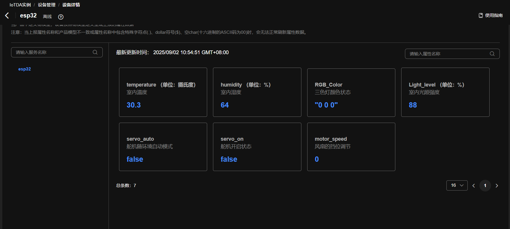
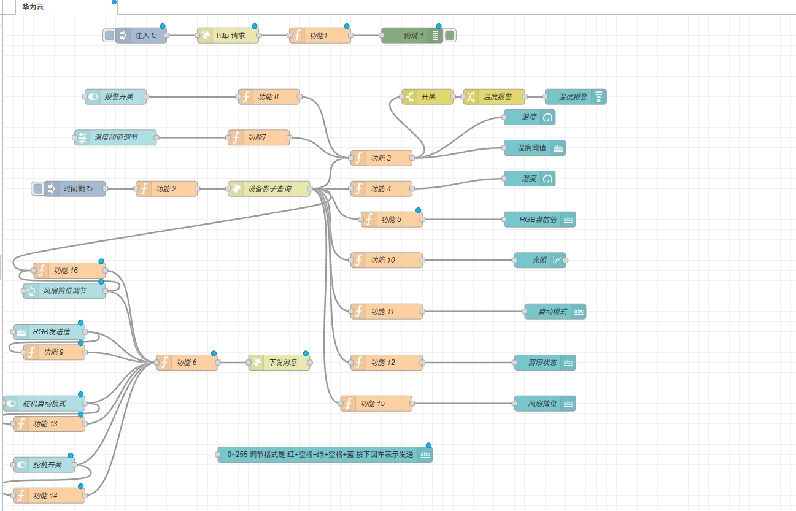
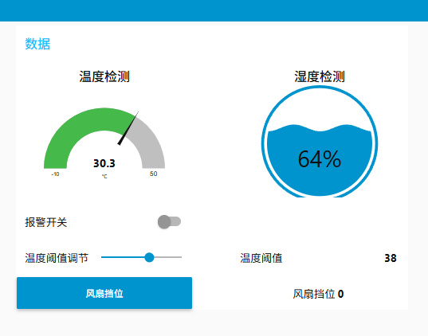
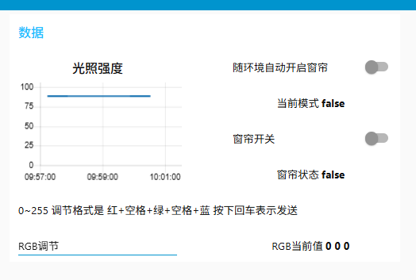

## 项目名称： ESP32 + MQTT + HTTP
## 项目作者： capture-su
## 项目概述

本项目是一个基于ESP32的智能环境监测与控制系统，能够通过多种传感器采集环境数据，并通过执行器对环境进行调节。项目集成了温湿度传感器、光照传感器、RGB LED灯、舵机和直流电机，与华为云平台进行数据交互，实现智能控制。

## 主要功能

- **环境监测**：
  - 实时监测环境温湿度（DHT11传感器）
  - 监测环境光照强度（光敏电阻传感器）
  
- **设备控制**：
  - RGB全彩灯控制，可调节颜色和亮度
  - 舵机角度控制，支持自动和手动模式
  - 直流电机速度控制，支持多档调速

- **云平台连接**：
  - 通过WiFi连接网络
  - 使用MQTT协议与华为云IoTDA平台通信
  - 定时上报传感器数据到云平台
  - 接收并处理来自云平台的控制指令
  

## 技术特点

- 使用WiFiManager实现智能配网功能
- 采用ArduinoJson库处理JSON数据格式
- 通过MQTT协议实现设备与云平台的双向通信
- 支持OTA固件升级（预留功能）
- 模块化代码设计，易于扩展和维护

## 应用架构

- **设备层**：ESP32开发板连接各类传感器和执行器
- **通信层**：通过MQTT协议连接华为云IoTDA平台
- **应用层**：采用Node-RED实现可视化控制界面和数据处理

- **网络穿透**：使用cpolar实现内网穿透，使外部网络可以访问本地Node-RED服务

## 应用场景

本项目可应用于智能家居、环境监测、农业物联网、智能控制等多种场景，为构建完整的物联网解决方案提供了基础框架。
</file>

